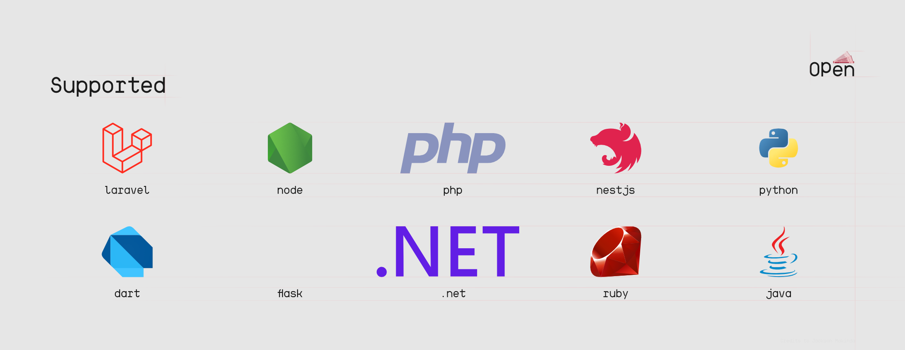

<a href="https://github.com/openpesa">
  

    <picture>
      <source height="150px" media="(prefers-color-scheme: dark)" srcset="./assets/img/brand/logo/brand.png">
      
    </picture>
  

</a>
 

An open-source payments integration toolkit for businesses and developers.
 

## Description 📇

Openpesa is an open-source payments integration toolkit designed to simplify payment gateway integration for businesses and developers. It offers a seamless and user-friendly solution to streamline financial transactions, making it easy to integrate payment gateways into your applications.

Openpesa provides a comprehensive set of tools and APIs for various payment methods, ensuring a consistent and smooth payment experience across different platforms. It is built with the latest technologies to make payments secure, efficient, and hassle-free.

  <picture alt="Credits to Jackson Makinda">
    <source media="(prefers-color-scheme: dark)" srcset="./assets/img/banner/supported.png">
    
  </picture>

With Openpesa, businesses and developers can enhance their applications and websites with robust payment processing capabilities.

## Features ✅

- Simplifies payment gateway integration
- Supports a wide range of payment methods
- Provides secure and efficient payment processing
- Offers documentation and resources for easy implementation
- Enables businesses to accept payments online and in-app
- Enhances user experience by offering seamless payment options

## Getting Started 🎬

To begin your journey with Openpesa, please refer to the README in each repository for detailed instructions.

## Contributing 🤝🏽

If you're interested in contributing to the Openpesa project, feel free to reach out to any of our contributors for guidance, or follow the contribution guidelines provided in the repository you'd like to work on.

### Contributors 👥

Openpesa is made possible by the hard work and dedication of our passionate [team](https://github.com/orgs/openpesa/people).

Thank you for your valuable contributions! 🧡
